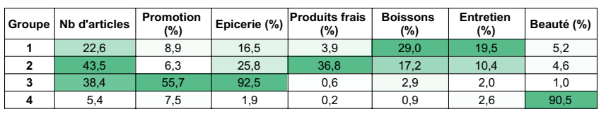

README
================

Aujourd'hui, et quel que soit le domaine, les utilisateurs sont désormais de plus en plus habitués à recevoir des mails ou offres personnalisées selon leurs besoins. Le marketing de masse a montré ses limites, et les utilisateurs souhaitent se différencier et être reconnus et adressés en tant qu'individu à part entière, unique.

L'explosion du nombre de données et les progrès technologiques ont rendu possible une meilleure connaissance des utilisateurs, en ligne mais aussi hors ligne. Cette acquisition de connaissance est devenue une nécessité pour chaque entreprise afin d'obtenir une expression d'intérêt de la part des utilisateurs.

Tout au long de l'article, les différentes notions abordées seront illustrées par une étude de cas de segmentation client : Ulabox, un site espagnol de vente d'articles d'épicerie et de produits courants.

Segmentation des utilisateurs
-----------------------------

Comme vous ne pouvez pas encore réellement envoyer un message personnalisé à tous vos utilisateurs, l'idée est de les séparer en différents groupes homogènes, appelés segments. Par groupes homogènes, il faut comprendre des groupes de personnes ayant des comportements ou des intérêts similaires. Vous pourrez alors adresser ces différents groupes de manière séparée et beaucoup plus efficace.

Les algorithmes de Data Science permettent de segmenter rapidement de grosses bases de données clients et vous font gagner en efficacité et en précision par rapport à une segmentation manuelle.

Ulabox a partagé une partie de ses données clients anonymisées sur le site Kaggle (<https://www.kaggle.com/ulabox/ulabox-orders-with-categories-partials-2017>). Dans cette base de données on trouve la description d'environ 30000 achats effectués par 10000 clients. Pour chaque achat, on dispose :

-   de l'ID client,

-   du nombre d'articles achetés,

-   du pourcentage moyen de réduction sur le panier,

-   le jour et l'heure de la commande,

-   la répartition du panier selon : l'épicerie, les produits frais, les produits de beauté ou d'entretien, etc.

Ici, le but de la segmentation est de déterminer des profils de clients types qui recevront ensuite des communications et promotions personnalisées en fonction de leurs intérêts. Cela permettra également d'apprécier le potentiel de croissance d'achat ou non de chacun des segments. La qualité des données est essentielle pour une étude de segmentation. En effet, il est nécessaire que toutes les variables que vous souhaitez prendre en compte soient correctement renseignées et ne contiennent pas de valeurs manquantes.

La suite de l'étude est faite sous R, un langage de programmation spécialisé dans les analyses de données. Les données étant déjà nettoyées avant d'être mises en ligne, on procède directement à une segmentation client.

Voici les différentes étapes :

-   Créer une nouvelle base de données, triée non plus selon les achats effectués mais selon les ID des clients, afin de pouvoir les séparer ensuite en plusieurs groupes ;

-   Lancer un premier algorithme qui va calculer le nombre de sous-groupes optimal pour la base données. En-dessous de 2 ou 3 sous groupes, la segmentation n'est pas forcément très utile. Cela permet de trouver le meilleur compromis entre la complexité apportée par la segmentation et la cohérence des sous-groupes. Ici, le nombre optimal de sous est de 4.

-   On lance ensuite l'algorithme de segmentation à proprement parler, qui va déterminer 4 "profils moyens" et attribuer à chaque client un profil en particulier. Ici, il s'agit de l'algorithme "K-means". Ensuite, c'est à vous de prendre du recul et d'interpréter les résultats obtenus.

Pour Ulabox, voici les caractéristiques moyennes des 4 profils déterminés par calcul :

Etude et analyse de chaque segment de la base
---------------------------------------------

Voici comment interpréter les différents profils trouvés par calcul.

-   Groupe 1 : Profil : citadin et célibataire avec un nombre d'articles limité, des achats diversifiés et un pourcentage important de boissons, Taille : 5816 clients

-   Groupe 2 : Profil : a priori plus familial avec un nombre d'articles élevé et une forte dominance de produits frais et d'épicerie, Taille : 3269 clients

-   Groupe 3 : Profil : plutôt CSP-, qui profite très largement des promotions proposées (55% de rabais en moyenne, ce qui est très élevé par rapport aux autres groupes), Taille : 709 clients

-   Groupe 4 : Profil : personnes n'achetant quasi exclusivement que des produits de beauté, Taille : 445 clients

Ce premier découpage permet donc un ciblage beaucoup plus précis des clients et permet entre autres, de communiquer de manière préférentielle auprès de ceux qui sont les plus intéressés par vos produits.

Réalisation d'actions marketing afin d'augmenter la valeur générée par chaque segment
-------------------------------------------------------------------------------------

Les axes de communication pourraient être les suivants :

1.  Groupe 1 : proposer des packs complets "spécial soirée" ou "spécial apéro", permettant une montée en gamme en augmentant légèrement le nombre d'articles par panier

2.  Groupe 2 : Les quantités sont déjà importantes, s'assurer de la récurrence des achats. Faire des actions de relance abandonnistes essentiellement

3.  Groupe 3 : proposer des promotions et rabais sur des quantités plus élevées de produits afin de compenser les faibles marges par une quantité d'achat plus forte

4.  Groupe 4 : essayer une montée en gamme sur la beauté, limiter fortement les actions marketing sur le reste des produits pour réduire la pression commerciale, proposer éventuellement du cross-sell en valorisant l'accent beauté de certains produits d'épicerie
